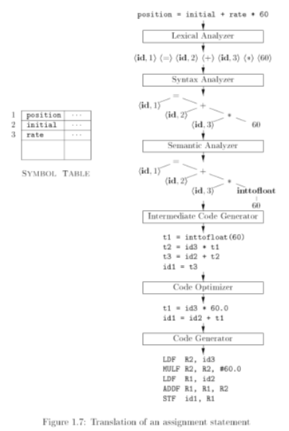

# Chapter 1 编译概论

## 1.1 语言处理器

**编译**: 从源语言 (或某种低层语言) 表示的算法到面向硬件的目标语言表示的算法的一个等价变换[^1] .

## 1.2 编译器的结构

编译器不仅要将源程序**映射**为 _语义等价_ 且 _可以执行_ 的目标程序, 还要对程序进行**优化**.

从源程序**映射**到可执行目标程序, 过程可以分为两部分:

1. **分析**: 通常称为前端
   - 中间表示: 将程序分解成为多个组成要素, 并加上语法结构, 创建中间表示
   - 检错: 检测语法或语义上的不一致性, 报错
   - 综合的前置步骤将**符号表** & **中间表示** (IR) 一起传递给综合部分
2. **综合**: 通常称为后端
   - 根据中间表示和符号表构造目标程序

> 分为前端 & 后端的一个重要考虑是**便于移植**.
>
> **优化**既有分析, 也有综合.

{ :style="height:200px"}

**语法树**: 语法分析生成语法树, 语义分析生成的语法树是已经经过修饰的语法树.

**中间表示** (IR): 一般将 **语法树**, **带注释的语法树**, **中间代码**, **符号表** 等统称为中间表示.

**符号表**: 贯穿编译的各个阶段, 甚至在程序运行时都有作用.

**错误处理**: 在编译的各个阶段都有所涉及, 但是编译能够发现的错误大多是在编译器的前端阶段发现的.

> **Preview**: 编译器的结构
>
> { style="height:340px" }

### 1.2.1 词法分析

**词法分析程序 (Scanner)** 将源程序的字符流组成记号流, 并在词法分析的同时完成一些可行的操作, 如填符号表.

**记号**: 逻辑上有内聚力的字符序列.

**单词**: 形成记号的字符序列, 被称为该记号的单词;

- 形如: `<token-name, attribute-value>`.

> **例** (词法分析)
>
> 赋值语句: `position = initial + rate * 60`
> 词法分析后可以得到 7 个单词:
>
> - 标识符 `position(<id,1>)`, `赋值号=(=/assignop)`, 标识符 `initial(<id,2>)`, 加号`+(+/addop)`, 标识符 `rate(<id,3>)`, 乘号`*(*/multop)`, 数字 `60(60/<num,60>)`.

### 1.2.2 语法分析

**语法分析程序 (Parser)** 将记号流按语言的语法结构层次分组, 最终得到分析树或语法树 (syntax tree).

**语法树**: 每个内部节点表示一个计算 (如前例的 `=`, `+`, `*` 等), 而叶子节点表示参与运算的记号; 树的层次表征了计算的优先次序 (如本例中 `*` 优先于 `+` ).

- 语法树是编译器后续工作的依托.

> **例** (语法分析)
>
> { :style="height:150px" }

### 1.2.3 语义分析

**语义分析程序 (Semantic Analyzer)** 检查程序的语义正确性.

**语义**: 程序的语义决定了程序的运行.

**静态语义**: 程序设计语言中存在在执行前可以确定而不易被语法表示的特征, 这些特征称为静态语义. 静态语义也是语义分析的内容.

典型的静态语义一般包括**声明**和**类型检查**等.

- 类型检查: 检测每个算符是否具有匹配的运算对象
- 可能会增加强制类型转换

语义分析程序计算得到额外信息 (如数据类型) 等, 这些额外信息将作为属性 (attribute), 填加到语法树中.

> **例** (语义分析)
>
> 

### 1.2.4 中间代码生成

把一个源程序翻译成目标代码的过程中, 一个编译器可能构造出一个或多个中间表示.

不同编译器选择的中间代码可能不同

- (中间代码?)是对机器的一种抽象
- 选择依据: 要易于生成, 且能够轻松翻译为目标机器语言

**三地址代码**是一种常用的低层表示:

- 每个指令具有 3 个运算分量
- 每条赋值指令右部只能有 1 个运算符, 指令次序决定了运算完成的顺序
- 编译器应该生成 1 个临时名字, 用来存放一个三地址指令计算得到的值
- 有些指令, 其运算对象可以少于 3 个

> **例** (生成三地址代码序列)
>
> ```
> t1 = inttofloat(60)
> t2 = id3 * t1
> t3 = id2 + t2
> id1 = t3
> ```

### 1.2.5 代码优化

**机器无关优化**: 改变中间代码, 得到更好的目标代码.

> **例** (Intersting fact about code optimization)
>
> - 一种合理的优质目标代码生成方法: 使用一个简单的算法生成中间代码, 其后再对其进行代码优化;
> - 一种常见的优化方式: 将可以提前到编译时刻完成的工作尽可能在编译时刻完成;
>   - 例: 将前例中的 `60` 直接变成 `60.0`, 可以消除 `inttofloat` 运算.
>   - Risk case: 由于编译程序的计算机与目标程序运行的计算机可能是不一样的, 在编译时刻完成某些工作, 可能是有风险的, 因此, 一种可能的方式是把要在编译时刻完成的计算放在目标机上真实执行, 把得到的计算结果用于编译器的优化和代码生成中

> 不同的编译器, 它们的优化存在很大的差异.

**目标代码优化器 (Target Code Optimizer)**: 改进目标代码.

> **例** (目标代码优化器):
>
> - 选择合适的编址模式, 以提高程序性能
> - 将速度慢的指令换为速度快的指令
> - 删除多余的代码
> - 寄存器优化
> - 软流水
> - ...

### 1.2.6 代码生成

**代码生成器 (Code Generator)** 将源程序对应的中间表示映射到目标语言, 生成目标代码.

- 如果目标语言是机器代码, 那么将变量映射为其在机器上的存储位置;
- 目标机器的特性是代码生成情况的主要影响因素;
- 寄存器的合理使用是一个重要问题.

> **例** (代码生成)
>
> ```
> LDF R2, id3
> MULF R2, R2, #60.0
> LDF R1, id2
> ADDF R1, R1, R2
> STF id1, R1
> ```

### 1.2.7 符号表管理

每个名字一个表项, 其中信息对存储管理等很重要.

### 1.2.8 将多个阶段组合成 "趟"

对于一个特定的实现, 前述的步骤都可以组合成为一个 "趟", 每趟读入一个输入文件, 并产生一个输出文件, 实现对程序的一趟处理.

### 1.2.9 编译器构造工具

> **Reading**
>
> 编译器是一个复杂的系统软件, 真实编译器的开发需要大量的工具的支持, 包括常规的软件开发类工具, 以及编译器开发特色的构造工具
>
> 特色工具: 使用专用语言描述和实现特定的组件, 本身算法可能很复杂, 但可以对编译器开发者隐藏细节
>
> 常用的工具:
>
> - 语法分析器的生成器, 如 YACC
> - 扫描器的生成器, 如 Lex
> - 语法制导翻译的引擎
> - 代码生成器的生成器, 基于规则生成代码生成器
> - 数据流分析引擎
> - 编译器构造工具集: 提供了构造编译器的不同阶段的例程地完整集合

## 1.3 程序设计语言的发展历程

> 历史进程略.

程序设计语言必须要有明确而确切的**定义**:

- 语法:合法程序的构成规则
  - 语法规则要满足: 可读性/ 可写性/ 易检验性/ 易翻译性/ 无二义性
- 语义: 构成程序的各个语法成分的意义; 程序的执行效果说明了程序的语义
  - 静态程序语义: 编译时刻可以确定的语义
  - 动态程序语义: 运行时刻才能确定的语义
- 语用: 语言符号与使用者之间的关系, 如变量的物理意义等

### 程序设计语言发展对编译器的影响

- 新的成分/ 机制的出现, 要求新的编译技术支持
  - 新的需求
  - 对编译实现的支持

#### 编译器技术的发展对语言的有力支持

- 优化效果是程序设计语言普及的一个重要推动因素
- 编译技术的发展可以简化/ 改良语言的设计

> 语言种类的相关介绍略.

## 1.4 构造一个编译器的相关科学

### 1.4.1 编译器设计和实现中的建模

- 建模抽象出数学范式, 设计, 通过实际测试来验证;
- 编译器的处理必须保证被编译程序的语义不变;
- 好的编译器具有普适性, 使得其编译的程序普遍获益.

最基本的数学模型是 FSM, RE, CFG 和树结构.

### 1.4.2 代码优化的科学

优化: 编译器通过优化, 以生成更高效的代码.

编译器优化必须满足下面的设计目标:

- 优化必须是正确的, 也就是说, 不能改变被编译程序的含义;
- 优化必须能够改善很多程序的性能;
- 优化所需的时间必须保持在合理的范围内;
- 所需要的工程方面的工作必须是可管理的;

## 1.5 编译技术的应用

> 编译技术在其他领域的应用有:
>
> - 高级程序设计语言的实现
> - 针对计算机体系结构的优化
> - 新计算机体系结构的设计
> - 程序翻译
> - 软件生产率工具
>   具体内容略.

## 1.6 程序设计语言基础

### 1.6.1 静态和动态的区别

> 在为一个语言设计一个编译器时, 最重要的问题之一是 **"编译器对一个程序可以做出哪些判定"**, 而另一个问题是 **"(语言中的) 声明具有何种作用域"**.

#### Q1: 编译器对程序可做出何种判定

**静态策略**: 如果某个语言使用的策略支持编译器 **静态** 决定某个问题, 则称这个语言使用了一个 **静态策略**, 或者说这个问题可以在 **编译时刻** (compile time) 决定.

- 如 C 语言中的变量名/ 变量类型.

**动态策略**: 一个只允许在运行程序的时候做出决定的策略被称为 **动态策略** (dynamic policy), 或者被认为需要在 **运行时刻** (run time) 做出决定.

- 如 C 语言程序变量 _(非常量)_ 的值

#### Q2: 声明具有何种作用域

**静态作用域** (static scope): 如果仅通过阅读程序就可以确定一个声明的作用域, 那么这个语言使用的是**静态作用域**, 或者说**词法作用域** (lexical scope).

**动态作用域** (dynamic scope): 如果仅通过阅读程序 **无法** 确定一个声明的作用域, 那么这个语言使用的是**动态作用域**.

> 如果使用动态作用域, 当程序运行时，同一个对 `x` 的使用会指向 `x` 的几个声明中的某一个.
>
> 大部分语言 (比如 C 和 Java) 使用静态作用域.

### 1.6.2 环境与状态

**环境** (environment): 从名字到存储位置的映射; 如果认为变量就是内存位置, 也可以理解为名字到变量的映射.

- 如 C 语言中的左值到内存位置的对应.

**状态** (state): 从内存位置到它们的值的映射.

- 如 C 语言中将左值映射为它们的相应右值.


### 1.6.3 静态作用域和块结构

> 本节内容: 考虑块结构语言的静态作用域规则, 其中块 (block) 是声明和语句的一个组合.

**块结构** (block structure): 允许一个块嵌套在另一个块内的嵌套特性.

" `D` 属于 `B` ": 如果块 `B` 是包含声明 `D` 的最内存的块, 那么称 `D` 属于 `B`.

在一个块结构语言中, 关于变量声明的静态作用域规则如下:

- 如果名字 `x` 的声明 `D` 属于块 `B` , 那么 `D` 的作用域包括整个 `B`.

### 1.6.4 显式访问控制

### 1.6.5 动态作用域

### 1.6.6 参数传递机制

### 1.6.7 别名

## References

<!-- 下面是脚注区域 -->

[^1]: 等价变换: 是指功能的等价性

```

```
