# C2 一个简单的语法制导翻译器

## 2.1 引言

> 本节概括性地说明了本章各节的内容, 可以跳过.

- **语法**: 给出程序**合乎规范**的形式要求 (但是合乎规范 != 正确)
- **语义**: 决定了程序的含义

为简便起见, 本课程主要关心**上下文无关文法** (CFG), 可以描述语言的文法.

> 实际生产环境中, 很多语言(的特性)其实是上下文有关的, 如 "先声明后使用".

CFG 不仅可以描述一个语言, 而且可以指导程序的翻译过程. 一种面向文法的编译技术是 **语法制导翻译** (syntax-directed translation).

下图是编译器前端的简易模型:

{ : style="height:150px"}

本节以中缀表达式->后缀表达式的语法制导翻译过程来介绍语法分析器.

词法分析器使得翻译器可以处理由多个字符组成的构造, 比如**标识符**. 标识符由多个字符组成, 但在语法分析阶段被当作一个单元 ("**词法单元** (token)") 进行处理.

考虑中间代码的生成. 中间代码有两种形式:

- 抽象语法树 (AST, 又称为语法树)

  - 表示了程序的层次语法结构
  - 一般而言, 树的左子树计算先于右子树实现
  - 语法树是编译器最重要的数据结构, 编译器的大部分工作是伴随着对 AST 的全部和部分的遍历而实施的

- 三地址指令序列
  - 形式: `x = y op z`
  - 2 个运算对象地址+1 个存放结果的地址
  - 最多一个运算, 一般是计算/比较/分支跳转

两种中间表示的在具体的例子中:

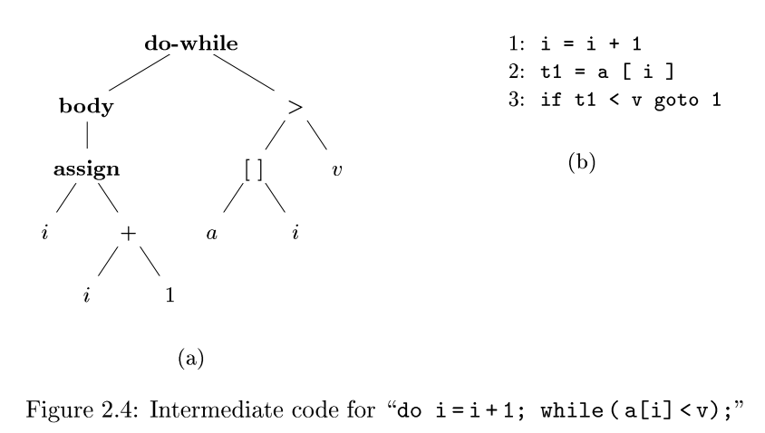{ : style="height:230px"}

## 2.2 语法定义

### 2.2.1 文法定义

#### 从字母到语言\*

(某语言的)字母表: (某语言中)允许出现的一切符号组成的有穷非空集合.

符号串: 由字母表中的符号组成的有穷序列称为符号串, 一般用小写字母 x,y,z 等表示; 可以是空串 $\epsilon$.

- 前缀, 后缀; 真前/后缀(=非空非原串)
- 子串 (从原子串删去某个前缀**或/和**后缀); 真子串 (=非空非原串)
- 子序列 (从原子串删去任意符号)

符号串运算:

- 连结(concat)
- 幂运算 (将连结看成积运算)

符号串集合运算:

- 乘积运算: $AB=\{xy|x\in A, y\in B\}$
  - $\{\epsilon\}A=A\{\epsilon\}$
- 闭包运算: $\Sigma^{*}=\Sigma^0\cup\Sigma^1\cup\Sigma^2\cup\cdots\cup\Sigma^{n}$
  - $\Sigma^{*}$ 称为集合 $\Sigma$ 的 **闭包**, 而 $\Sigma^{+}$ 称为集合 $\Sigma$ 的正闭包; 因此 $\Sigma^{*}=\Sigma^{0}\cup\Sigma^{+}$, $\Sigma^{+}=\Sigma^{*}\Sigma=\Sigma\Sigma^{*}$

句子 (=字): 在语言中, 句子是给定字母表上一个符号串.

语言: 在给定字母表上一个任意的可数的串集合.

#### 规则: 构成文法\*

例如:

$$
stmt\rightarrow \bf{\text{ if }} (expr)\text{ }stmt\bf{\text{  else }} stmt
$$

这样的规则称为 **产生式** (production), 其中:

- 箭头 $\rightarrow$ 可以读作 "可以具有如下形式"
- 像 $\text{if}$ 和 $\text{()}$ 这样的符号被称为 **终结符号** (terminal)
- 像 $expr$ 和 $stmt$ 这样的变量表示终结符号的序列, 被称为 **非终结符号** (non-terminal)

对于集合 $\Sigma$, 规则的左部是 $\Sigma^{+}$ 中的符号串, 规则的右部则是 $\Sigma^{*}$ 中的符号串.

> 文法在下一 h3 标题下详细介绍.

#### ※文法

文法 $G$ 定义为四元组:

$$
(V_N, V_T, P, S)
$$

也可以写成 $G[S]$.

| Item  | 含义              | 备注       |
| ----- | ----------------- | ---------- |
| $V_N$ | 非终结符号集合    | 非空有穷集 |
| $V_T$ | 终结符号集合      | 非空有穷集 |
| $P$   | 产生式的集合      | 非空有穷集 |
| $S$   | 开始符号/识别符号 | 非终结符号 |

补充:

- 作为开始符号, $S$ **至少**在一个产生式里作为规则的左部出现
- $V_N\cap V_T=\emptyset$
- $V=V_N\cup V_T$ 被称为文法 $G$ 的字母表

> 简单的判定方法: 非终结符一定在产生式左边, 产生式左边也一定是非终结符; 反之则对应右边.

### 2.2.2 推导 (归约)\*

- 直接推导: 应用单个产生式 $\alpha\rightarrow\beta$ 即可推导到目标串
- 长度为 $n$ 的推导
  - 若存在直接推导的序列 $v\rightarrow w_0\rightarrow w_1\rightarrow w_2\rightarrow \cdots\rightarrow w_n=w$ , 则称 $v$ 推导产生 $w$ 的推到长度为 $n$ / $w$ 归约到 $v$
  - 记作 $v\overset{+}\Rightarrow w$
  - 若有 $v\overset\Rightarrow w$ 或 $v=w$, 记作 $v\overset{*}\Rightarrow w$

#### 句型和句子\*

句型: 设 $G[S]$ 是一个文法, 如果符号串 $x$ 是从开始符号 $S$ 推导出来的, 即有 $S\overset{+}\Rightarrow x$ 则称 $x$ 是文法 $G[S]$ 的句型.

句子: 若推导出的符号串 $x$ 仅由终结符号组成, 即 $x\in V_T^{*}$, 则称 $x$ 为 $G[S]$ 的句子.

#### 语言\*

语言: 文法 $G$ 产生的语言记作:

$$
\bf{L(G)}=\{x|S\overset{*}\Rightarrow x, x\in V_T^{*}, S\text{ 为文法的开始符号}\}
$$

借助语言可以定义文法的等价:

- $L(G)=L(G^{\prime})\Rightarrow$ 文法 $G$ 和文法 $G^{\prime}$ 等价
- 两个文法等价=从两个文法得到的语言的句子结构等价!=含义等价

> **扩展**: Chomsky 语言族
>
> | Item     | Description         | Equivalent Instance        |
> | -------- | ------------------- | -------------------------- |
> | 0 型文法 | 短语结构文法/ PSG   | 图灵机 (TM)                |
> | 1 型文法 | 上下文有关文法/ CSG | 线性界限自动机 (LBA)       |
> | 2 型文法 | 上下文无关文法/ CFG | 下推自动机 (PDA)/ BNF 形式 |
> | 3 型文法 | 正则文法/ RG        | 有穷状态自动机 (FSM)       |
>
> 0 型语言类 $\supset$ 1 型语言类 $\supset$ 2 型语言类 $\supset$ 3 型语言类, 即表达能力递减.

#### 语言的运算\*

设 $L, L_1, L_2$ 分别是定义在字母表 $\Sigma, \Sigma_1, \Sigma_2$.

| Operation | Definition                                                        |
| --------- | ----------------------------------------------------------------- |
| 并        | $L_1\cup L_2=\{x \lvert x\in L_1, \text{or }x\in L_2\}$           |
| 交        | $L_1\cap L_2=\{x \lvert x\in L_1, \text{and }x\in L_2\}$          |
| 补        | $\overline{L}=\{x \lvert x\in \Sigma^{*}, \text{and }x\notin L\}$ |
| 积        | $L_1L_2=\{xy \lvert x\in L_1, \text{and }y\in L_2\}$              |
| 幂        | $L^0=\{\epsilon\}$, $L^n=L^{n-1}L=LL^{n-1}, n\geq 1$              |
| 闭包      | $L^{*}=\bigcup_{i=0}^{\infty} L^i$                                |
| 正闭包    | $L^{+}=\bigcup_{i=1}^{\infty} L^i$                                |

> 由最后两行, 显然可知:
>
> - $\{\epsilon\}L=L\{\epsilon\}=L$
> - $\emptyset\cup L=L\cup\emptyset=L$
> - $L^{+}=LL^{*}=L^{*}L$

#### 语言类对运算的封闭性\*

**封闭性**: 对于某个给定的语言类中的语言, 如果进行某种运算后得到的新语言与原有语言有相同的语言类, 则称**该语言类对该运算是封闭的**, 否则称该语言类对该运算是不封闭的.

- 各型语言对 **并/ 积/ 闭包** 运算均封闭;
- 2 型语言 (上下文无关语言) 对 **交/ 补** 运算不封闭;
- 3 型语言 (正则语言) 对 **交/ 补** 运算封闭 (形成一个布尔代数).

#### 文法与程序分析

- 编译器的词法: 3 型文法 (RG)
- 编译器的语法: 2 型文法 (CFG)

### 2.2.3 语法分析树

> **语法分析** (parsing) 的任务是: 接受一个终结符号串作为输入, 找出从文法的开始符号推导出这个串的方法.
>
> - 如果不能从文法的开始符号推导得到该终结符号串, 则报告该终结符号串中包含的语法错误.

**语法分析树**: 用图形的方式展现了程序的语法结构, 树的每个结点代表了一个文法符号.

**语法树的构建过程**表征了语法分析的过程.

语法树可以有多个**结点** (node), 但是只有一个根结点, 其标号是文法的开始符号.

- 每个叶子结点的符号是一个终结符号或者 $\epsilon$,
- 每个内部结点 (非叶结点) 的符号是一个非终结符号.

以 A 为根结点, $x_1, \cdots, x_n$ 为叶结点的子树对应产生式 $A\rightarrow x_1\cdots x_n$; 因此, 自左向右将语法树的所有叶结点依次连接, 就可以得到符合文法的一个句子, 称为树的 **结果** (yield).

> Try: 产生式 $A\rightarrow\epsilon$ 对应的子树形状是?

任何树的叶子结点都有一个自然的从左到右的顺序.

> Intuition: 若 `x` 和 `y` 是同一个父结点的子结点, 并且 `x` 在 `y` 的左边, 则 `x` 的所有后代结点都在 `y` 的所有后代结点的左边.

### 2.2.4 二义性

如果一个文法, 对于同一个终结符号串, 存在两个或多个与之对应的语法树, 则称该文法具有**二义性** (ambiguity).

注意:

- "多棵语法树" 不是指有多个推导, 因为即便只有一棵语法树, 也可以有最左/最右等推导
- 只要有一个句子对应了多棵语法树, 即为二义性文法

二义性往往导致程序可能具有多种含义, 使得编译器的工作难以顺利进行, 所以要排除二义性

> 二义性带来的麻烦: 如算符的优先顺序/结合性, `if-then-else` 的匹配等

### 2.2.5 算符的结合性

结合性举例:

- `+, -, *, /` 是左结合的
- `乘幂/赋值` 是右结合的

如下比较了左结合运算符和右结合运算符的语法分析树, 可以看到, 左 (右) 结合运算符将向左 (右) 下端延伸.

{ : style="height:200px"}

### 2.2.6 算符的优先性

优先性举例:

- 通常 `*, /` 优先于 `+, -`

※在表达式文法中, 若具有 $n$ 层优先级, 则需要 $n+1$ 个非终结符号.

## 2.3 语法制导翻译

语法制导翻译是将语义动作与产生式关联的方式.

**属性** (attribute): 属性表示与某个程序构造相关的任意的量.

- 属性与文法符号相关联;
- 每个文法符号可以有多个属性, 可以用一个属性集合来表示

> 属性可以是多种多样的, 比如:
>
> - 表达式的数据类型
> - 生成的代码中的指令数目
>   为某个构造生成的代码中第一条指令的位置等等都是属性的例子.
>
> 因为我们用文法符号 (终结符号或非终结符号) 来表示程序构造, 所以我们将属性的概念从程序构造扩展到表示这些构造的文法符号上.

(语法制导的) **翻译方案** (translation scheme): 翻译方案是一种将程序片段附加到一个文法的各个产生式上的表示法.

> - 当在语法分析过程中使用一个产生式时, 相应的程序片段就会执行.
> - 将这些程序片段的执行效果按照语法分析过程的顺序组合起来, 得到的结果就是这次分析/综合过程处理源程序得到的翻译结果.

### 2.3.1 后缀表示

**后缀表示**(postfix notation):

- 如果 $E$ 是一个变量或常量, 则 $E$ 的后缀表示就是 $E$ 本身
- 如果 $E$ 是一个形如 $E_1 {\rm op} E_2$ 的表达式 (op 是二目算符), 则其后缀表示是 $E_1^{\prime}E_2^{\prime}{\rm op}$, 其中 $E_1^{\prime}$ 和 $E_2^{\prime}$ 分别是 $E_1$ 和 $E_2$ 的后缀表示
- 如果 $E$ 是一个形如 $(E_1)$ 的表达式, 则其后缀表示就是 $E_1$ 的后缀表示

> 后缀表示不用括号, 便于用栈实现计算.

### 2.3.2 综合属性

属性的计算是有约束的.

**语法制导定义** (syntax-directed definition):

1. 把**文法符号**与**属性集合**相关联;
2. 把**产生式**与**语义规则**相关联;
   - **语义规则** (semantic rule): 用于计算与该产生式中符号相关联的属性值.

**注释语法分析树**: 如果一棵语法分析树的各个结点上标记了相应的属性值, 那么这棵语法分析树就称为注释语法分析树 (annotated AST, 简称注释分析树).

如下即为一棵注释分析树:

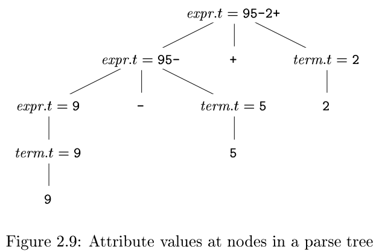{ : style="height:250px"}

> 语义规则的计算也称为对语法树的注释, 得到的就是注释分析树.

**综合属性**: 如果语法树上结点 $N$ 的某个属性值是由 $N$ 的子结点**和/或** $N$ 自身的属性值确定, 则称这个属性为综合属性.

> 若 $s$ 是 $X$ 的属性, $t_1,\cdots, t_m$ 是 $Y_1,\cdots,Y_n$ 或 $X$ 的属性, 且属性 $s:=f(t_1,\cdots, t_m)$, 则 $s$ 是 $X$ 的综合属性.

**※综合属性的性质**: 只需要对语法分析树进行一次自底向上的遍历(i.e. 后序遍历), 就可以计算出属性的值.

> 继承属性: 如果结点 $N$ 的某个属性计算需要用到其兄弟结点 or 父结点的属性值, 则称为继承属性.

下面给出 "中缀表示 to 后缀表示" 这一翻译过程的 **语法制导定义**:

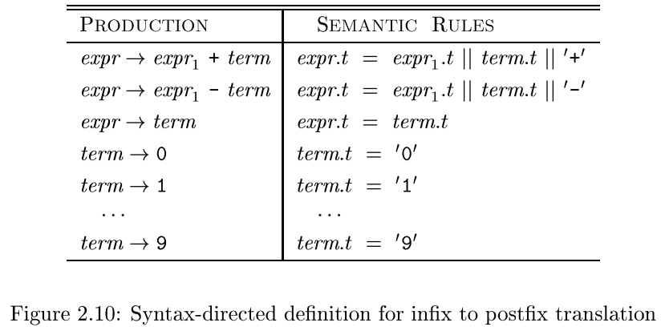{ : style="height:200px"}

以第一行为例,

$$
expr\rightarrow expr_1+term
$$

推导出一个带有加号的表达式,

- 左运算分量由 $expr_1$ 给出
- 右运算分量由 $term$ 给出

与这个产生式 **关联** 的 **语义规则**

$$
expr.t = expr_1.t\ |\ term.t\ |\ \text{'+'}
$$

定义了计算属性 $expr.t$ 的值的方式: 将左/右运算分量 ($expr_1$ 和 $term$) 的后缀表示形式 ($expr_1.t$ 和 $term.t$) 连接起来, 再在后面加上加号.

### 2.3.3 简单语法制导定义

**简单 (simple) 语法制导**的定义:

- 要得到代表产生式头部的非终结符号的翻译结果的字符串, 只需要将产生式右部中各非终结符的翻译, 结果**按照它们出现的次序连接**, 并在其中穿插一些附加的串, 就可以得到产生式左部非终结符的翻译结果;
- 最终根结点的 $t$ 属性记录了翻译结果

### 2.3.4 树的遍历

树的 **遍历** (traversal): 从根结点开始, 并按照某个顺序访问树的各个结点.

> 深度优先: 从根结点开始递归访问各个结点的子结点. 可先序/后序.

语法制导定义未指明属性计算的次序, 因此只要保证计算某个属性 $a$ 的值时, 其所依赖的属性都已计算完成即可.

- 对于那些需要与语法分析同时完成的属性计算, 计算次序选择受到了一定的约束
- 程序处理的自然顺序是从前向后扫描程序, 语法分析时对产生式的处理是从左到右的; 对应到语法树, 也是从左向右同一父结点的各个子结点

对于一个综合属性, 可以按照深度优先后序遍历的顺序计算, 即自底向上的翻译, 这与上一节讨论的顺序是一致的.

### 2.3.5 翻译方案

在 [2.3.2](/chap_02/#232) 节刻画的语法制导定义是这样翻译的: 将字符串作为属性值, 附加在语法分析树的结点上, 从而得到翻译结果.

下面考虑一种不需要操作字符串的方法: 它通过运行程序片段, 逐步生成相同的翻译结果.

**语法制导翻译方案**是一种在文法产生式中附加一些程序片段来描述翻译结果的表示方法. 语法制导翻译方案和语法制导定义相似, 只是**显式指定了语义规则的计算顺序**.

被嵌入到产生式体中的程序片段被称为 **语义动作** (semantic action). 一个语义动作用花括号括起来, 并写入产生式体, 它的执行位置也由此指定.

考虑如下的规则:

$$
rest\rightarrow \text{'+'}\ term\ |\text{ print('+') }|\ rest_1
$$

对应地为语义动作创建一个额外的叶子结点:

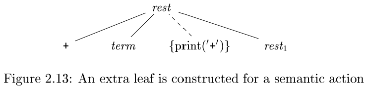{ : style="height:100px"}

对于 "`9-5+2` to `95-2+`" 这一中缀表示翻译到后缀表示的过程, 有如下的语义动作: (根结点是 `9-5+2`, 下面翻译出了 `95-2+`:

{ : style="height:200px"}

更一般地, 表达式从中缀表示翻译成后缀表示的语义动作如下:

{ : style="height:180px"}

注意! 使用语义动作的方式时, 不需要任何附加空间来存放子表达式的翻译结果, 因此在增量输出时, 字符的打印顺序非常重要: 必须保证各个语义动作按照它们在语法分析树的后序遍历顺序执行.

> **比较**: 语义规则 vs 语义动作
>
> | Item           | 语义规则                   | 语义动作               |
> | -------------- | -------------------------- | ---------------------- |
> | 额外空间       | 需要, 存放子表达式翻译结果 | 不需要                 |
> | 操作字符串?    | 需要                       | 不需要, 依赖 "动作"    |
> | 顺序?          | 一般后序, 无要求           | 后序遍历地实现语义动作 |
> | 语法分析树结点 | +属性值, (=翻译结果)       | 需增加语义动作结点     |
>
> 两者都是翻译方案, 在案例中也给出了相同的结果, 但是构造结果的过程是不同的:
>
> - 语义规则: 把字符串 (翻译\[中间\]结果) 作为属性附加到语法分析树中的结点上
> - 语义动作: 通过语义动作把翻译结果以**增量**方式打印出来

## 2.4 语法分析

语法分析是决定如何使用一个文法生成一个终结符号串的过程.

多数语法分析方法都可以按 **语法分析树结点的构造顺序** 归入以下两类:

- **自顶向下** (top-down) 方法
  - 构造过程从根结点开始, 逐步向叶子结点方向进行
  - 可以较容易地手工构造出高效的语法分析器; 但要避免回溯/消除左递归/消除左因子等
  - 典型: 递归下降, LL 分析等
- **自底向上** (bottom-up) 方法:
  - 构造过程从叶子结点开始, 逐步构造出根结点
  - 构造复杂, 但可以处理更多种文法和翻译方案
  - 直接从文法生成语法分析器的软件工具常常使用自底向上的方法
  - 典型: 算符优先, LR 分析等

### 2.4.1 自顶向下分析方法

不是所有的文法都适合采用自顶向下的方法.

如何**自顶向下地构造一棵语法分析树**?

- 从标号为 **开始非终结符** $stmt$ 的根结点开始, 反复执行如下步骤:
  1. 在标号为非终结符号 $A$ 的结点 $N$ 上, 选择 $A$ 的一个产生式, 并为该产生式体中的各个符号构造出 $N$ 的子结点;
  2. 需找下一个结点来构造子树, 通常选择的是语法分析树最左边的尚未扩展的非终结符.

**向前看** (lookahead) 符号: 输入中当前被扫描的终结符号.

> 对于某些文法, 上面的步骤只需要对输入串执行一次自左至右的扫描即可. 在这种情况下, 向前看符号是输入串最左的终结符号.

#### 实例: 从左到右扫描输入串时进行自顶向下语法分析

规则:

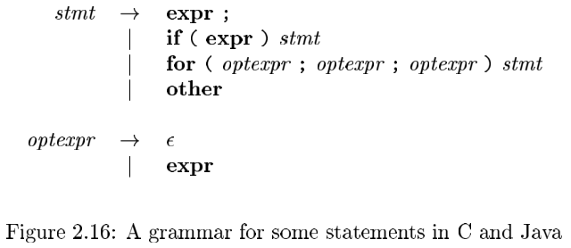{ : style="height:150px"}

对输入串的自顶向下语法分析过程:

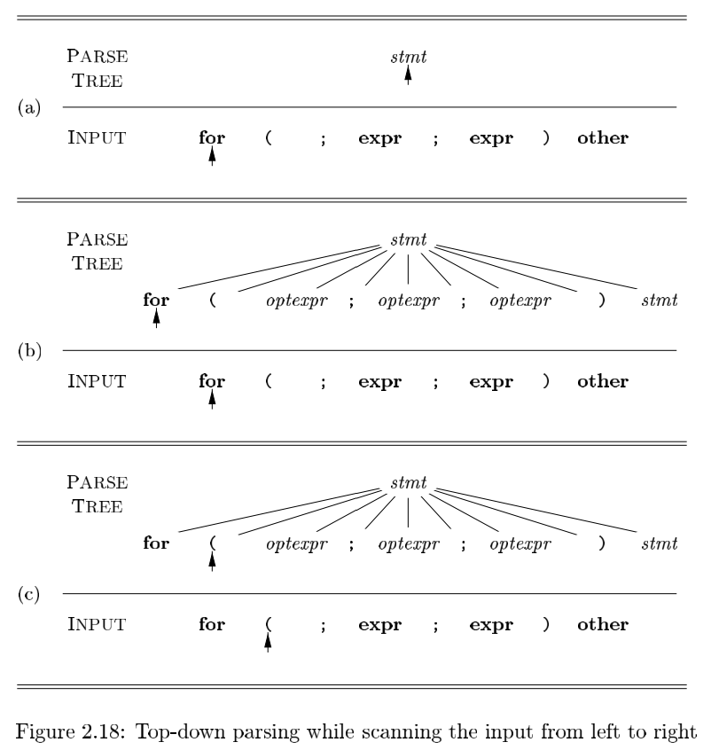{ : style="height:400px"}

- 图 (a): 扫描到 `for`
  - 只有唯一的产生式选择, 于是按这一条扩展结点;
  - 扩展完毕后, 指向该结点的最左子结点
- 图 (b): 正在考虑的语法分析树结点是一个终结符号
  - **向前看符号** 与 **正在分析的终结符号** 匹配, 于是输入箭头和语法分析树箭头都前进一步
- 图 (c): `(` 符号匹配, 前进
  - 遇到需要 $\epsilon$ 的情况 ( $\epsilon$ 被视为 no-match 情况下 default)

> 一个产生式 "不合适" 是指使用了该产生式之后, 我们无法构造得到一棵与当前输入串相匹配的语法分析树.

自顶向下分析中, 为一个非终结符号选择产生式是一个 "尝试并犯错" 的过程: 首先选择一个产生式, 并在这个产生式不合适时进行回溯, 再尝试另一个产生式. 但是, 在被称为预测语法分析的特殊情形下不需要进行回溯.

### 2.4.2 预测分析法

> 递归下降分析方法 (recursive-descent parsing) 是一种自顶向下的语法分析方法, 它使用一组递归过程来处理输入; 文法的每个非终结符都有一个相关联的过程, 完成对这个文法符号的分析工作, 过程的调用序列隐式的定义了对应输入串的语法树.

**预测分析法** (predictive parsing) 是递归下降分析法的一种简单形式:

1. 各个非终结符号对应的过程中的控制流可以由向前看符号无二义地确定;
2. 在分析输入串时出现的过程调用序列隐式地定义了该输入串的一棵语法分析树;
   - 如果需要, 还可以通过这些过程调用来构建一个显式的语法分析树.

相比于前一小节提到的最平凡的自顶向下分析法, 预测分析法**增加了一个过程: `match`**.

`match` 判别正在构建的语法树当前结点的终结符号是否与向前看的符号匹配,

- 如果匹配, 则推进向前看符号;
- 如果不匹配, 要报错.

#### 实例: 使用预测分析器分析输入串

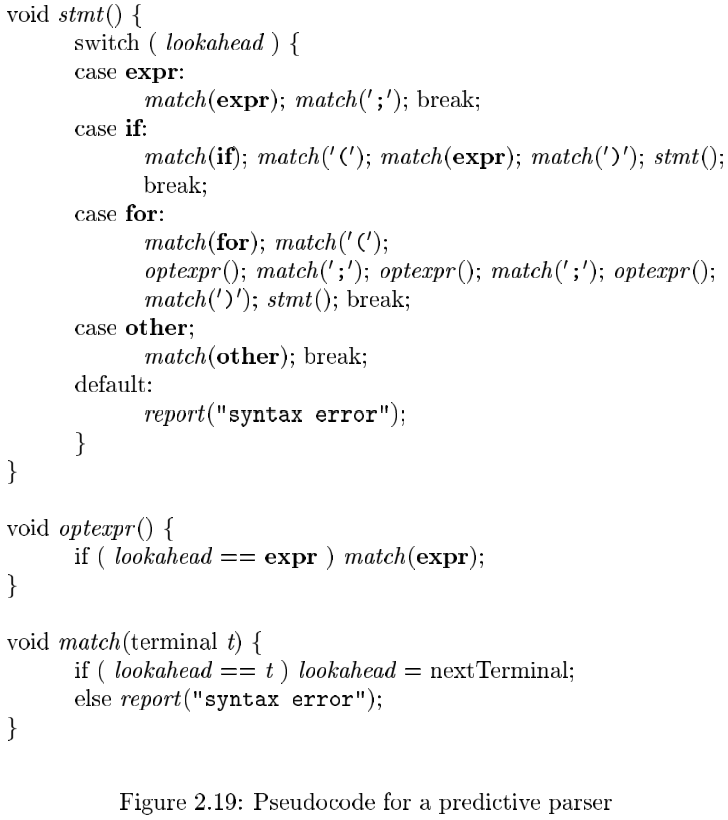{ : style="height:400px"}

图中的预测分析器包含了两个过程 `stmt()` 和 `optexpr()`, 分别对应于 [图 2-16](/chap_02/#_9) 中文法的非终结符号 $stmt$ 和 $optexpr$. 该分析器还包括一个额外的过程 `match`. 这个额外过程用来简化 `stmt` 和 `optexpr` 的代码.

#### 在一个结点有多个可选的产生式的情形

预测分析需要知道哪些符号可能成为产生式体所生成串的第一个符号. 于是引入记号 **$FIRST(\alpha)$**:

- $\alpha$ 是一个文法符号串 (终结符号/非终结符号组成)
- $FIRST(\alpha)$ 是可以由 $\alpha$ 生成的一个 or 多个终结符号串的第一个符号的集合.
  - 如果 $\alpha\overset{*}\epsilon$, 则 $\epsilon\in FIRST(\alpha)$

如果有两个产生式 $A\rightarrow\alpha$ 和 $A\rightarrow\beta$, 且不考虑 $\epsilon$ 产生式, 预测分析法要求 $FIRST(\alpha)\cap FIRST(\beta)=\emptyset$, 则可以通过向前看符号来确定应该使用哪个产生式:

- 若向前看符号在 $FIRST(\alpha)$ 中, 就使用 $\alpha$;
- 若向前看符号在 $FIRST(\beta)$ 中, 就使用 $\beta$.

### 2.4.3 何时使用 $\epsilon$ 产生式

预测分析器没有其他产生式可用时, 将 $\epsilon$ 产生式作为默认选择使用.

> 在前面的例子中, 对 `optexpr` 进行语法分析时, 如果向前看符号不在 $FIRST(expr)$ 中, 我们就使用 $\epsilon$ 产生式.

### 2.4.4 设计一个预测分析器

[2.4.2](/chap_02/#242) 节中非正式介绍的技术可以被推广应用到任意具有如下**性质**的文法上: **对于文法的任何非终结符号, 它的各个产生式体的 $FIRST$ 集合互不相交**.

一个 **预测分析器** (predictive parser) 程序由各个非终结符对应的过程组成; 对于非终结符 $A$ 的处理过程:

- 检查向前看符号, 决定使用 $A$ 的哪个产生式:
  - 如果向前看的符号在某个产生式 $A\rightarrow\alpha$ 右部的 $FIRST(\alpha)$ 中, 采用这个产生式,
  - 如果有 $A\rightarrow\epsilon$ 产生式, 则只有向前看的符号**不在以 $A$ 为左部的任何产生式的右部的 $FIRST$ 集合中**时, 才采用;
- 在过程中模拟被选中产生式的右部, 即依次 "执行" 右部的每个文法符号:
  - 对于非终结符, 就是调用对应的过程,
  - 对于终结符, 就是与向前看符号匹配, 然后读入下一个输入符号;
- 无法继续处理时, 报错:
  - 找不到合适的产生式,
  - 当前结点的终结符与向前看符号不匹配.

> 就像通过扩展文法 (增加语义动作) 来得到一个翻译方案一样, 也可以通过扩展一个预测分析器来获得一个语法制导的翻译器.
>
> 根据翻译方案, 扩展预测分析器得到语法制导翻译器的一个简易过程:
>
> 1. 先不考虑产生式中的语义动作, 构造一个预测分析器;
> 2. 将翻译方案中的动作拷贝到语法分析器中.
>    - 如果一个动作出现在产生式 $p$ 中的文法符号 $X$ 的后面, 则该动作被拷贝到 $p$ 的代码中 $X$ 的实现之后
>    - 如果一个动作出现在产生式 $p$ 的开头, 则该动作被拷贝到产生式体 $p$ 的实现代码之前

如果已经有一个增加了语义动作的文法 (翻译方案), 则可以将这些语义动作当作该语法分析器的过程的一部分执行, 从而得到一个翻译器.

### 2.4.5 左递归

会产生左递归的:

$$
A\rightarrow A\alpha\ |\ \beta
$$

改写消除左递归:

$$
A\rightarrow \beta R\\
R\rightarrow \alpha R\ |\ \epsilon
$$

改写中使用的右递归的 $R\rightarrow\alpha R$ 来消除左递归.

## 2.5 简单表达式的翻译器

语法制导翻译方案常常作为翻译器的规约. 使用预测分析器时, 有时需要修改一个给定翻译方案的基础文法, 尤其是需要规避左递归的时候.

挑战:

1. 需要能支持翻译规约的文法
2. 需要能支持语法分析过程的文法

Solution:

1. 首先使用易于翻译的文法
2. 转换该文法, 使其支持语法分析

> **比较**: 语法制导翻译 vs 语法分析
>
> - 语法制导翻译是**将语义动作与产生式关联**的方式
> - 语法分析是决定**如何使用一个文法生成一个终结符号串**的过程
>
> (显然我还是没懂)

### 2.5.1 抽象语法和具体语法

语法树的两种形式:

- 语法分析树
  - 内部结点是文法的非终结符, 叶结点是终结符
  - 所有的叶结点依次相连, 就构成了对应的句子
  - 结点数目多
- **※抽象语法树** (AST)
  - 编译常用的数据结构, **内部结点** 对应 **算符** (如 `+/-` 等), 算符的子结点对应了该算符的运算对象
  - 没有形如 $expr\rightarrow term$ 的单产生式对应的结点, 也没有 $\epsilon$ 产生式对应的结点
  - 结点数目少

### 2.5.2 调整翻译方案

[2.3.5 节](chap_02/#235) 中的翻译方案虽然简明, 但是会造成左递归, 而这是语法分析器无法处理的情形, 因此需要用 [2.4.5 节](/chap_02/#245) 中提到的方法消除左递归.

消除左递归的过程涉及适当地调整嵌入的语义动作.

### 2.5.3 非终结符号的过程

借鉴前面的过程, 将非终结符号视为 "过程" 是合理的, 这种函数模拟了非终结符号的产生式体.

**例子**:

{ : style="height:400px"}

### 2.5.4 翻译器的简化

递归可以优化为迭代, 提高程序的效率. (主要是指尾递归...)

**例子**: [2.5.3 节](/chap_02/#253) 中的 `rest` 过程, 可以修改为:

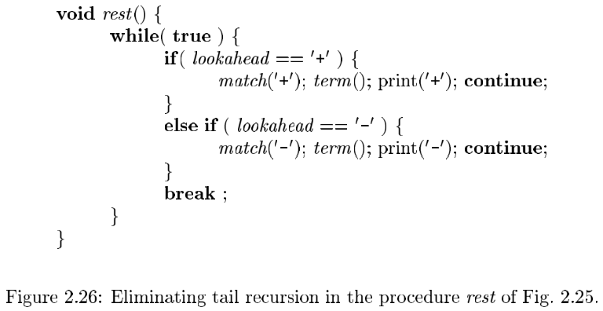{ : style="height:200px"}

此外, 将递归修改为迭代之后, 还可以将 `rest` 过程直球塞进 `expr` , 两个过程合一了.

> 2.5.5 节 (完整的程序) 略

## 2.6 词法分析

翻译器/语法分析的**输入终结符** = **词法分析的输出**.

词法分析附加了一些信息, 例如行号等. 词法分析要处理空格/ 制表符/ 换行符/ 注释等

一个词法分析器从输入中读取字符, 并将它们组成 "词法单元对象"

**词法单元对象** 包含:

- 用于语法分析的终结符号之外
- 一些以属性值的形式出现的附加信息

> 目前还不需要区分术语 _词法单元_ 和 _终结符号_ , 因为语法分析器忽略了词法单元中带有的属性值.
>
> 本节中, 一个词法单元 = 一个带有附加信息的终结符号.
>
> 构成一个词法单元的输入字符序列称为词素 (lexem). 因此可以说 "词法分析器使得语法分析器不需要考虑词法单元的词素表示方式".

### 2.6.1 剔除空白和注释

在遇到空格/ 制表符/ 换行符时不断读取输入字符, 从而跳过对于语法分析的 "空白" 部分.

### 2.6.2 预读

为了解决 `>` 和 `>=` 的判定, 因此引入预读; 一般会想到引入缓冲区; 一般再多看一个符号就可以, 不过要注意回退.

### 2.6.3 常量

常量的词法结果可以采用 `<num, val>` , 其中 `val` 为其值. (词法单元都用加 `<>` 的元组给出)

### 2.6.4 识别关键字和标识符

**关键字**: 多数语言中将某些固定的字符串作为某些构造的标识或标点符号, 如 for/ do/ if 等.

> 有些语言, 关键字不是保留字, 可以被程序员当作变量名等使用, 难以区分标识符和关键字, 给词法分析带来问题

**标识符**: 词法分析识别的字符串, 可用于变量/ 常量/ 函数等的命名, 用 id 标识

可以使用 **表** 保存字符串, 并可以进一步采用 Hash 表优化访问速度:

- 字符串表将编译器的其它部分和表中字符串的具体表示隔离开
  - 编译器的其他部分直接访问符号表, 而不必关心字符串的具体表示, 操作更高效
- 入表时先查询, 避免同名标识符重复入表
  - 这个特点的一个应用是**避免重复声明**
- 保留字容易区分
  - 建表之初将关键字入表,
  - 在读取可以组成标识符的字符串/词素时, 先检查字符串表内是否有这个词素

> 2.6.5 (词法分析器) 略

## 2.7 符号表

**符号表** (symbol table) : 供编译器用于保存有关源程序构造的各种信息[^1] 的数据结构.

- 符号表的每个条目中包含与一个标识符相关的信息, 比如它的字符串 (或者词素)/ 它的类型/ 它的存储位置和其他相关信息.
- 符号表通常需要支持同一标识符在一个程序中的多重声明

**谁能访问符号表?** 编译器的各个阶段都可能对符号表进行访问/ 操作. 符号表在编译/ 调试等阶段都有用.

**谁来创建符号表条目?** 符号表条目在分析阶段由词法分析器, 语法分析器与语义分析器创建并使用. 本章使语法分析器创建符号表条目, 因为语法分析器对程序的**语法结构**更了解.

> 思考: 符号表条目和语法结构的关系?

词法分析器当然可以在碰到组成一个词素的字符串时立即建立一个符号表条目, 但是实际上一般它只 **向语法分析器返回一个词法单元**, 比如 `id` 以及指向这个词素的指针, 语法分析器来决定是否创建一个新条目.

> 有的语言允许对于一个名字的声明通过多个语句完成, 因此符号表表项的建立可能需要多步.

### 2.7.1 为每个作用域设置一个符号表

**作用域** (scope) 是指一个或多个声明起作用的程序部分.

- 作用域可以嵌套;
- 对标识符作用域的解释采用 **最近嵌套** (most-closely) 原则;
- 当一个作用域终结时, 对标识符的解释可能发生变化.

在一些语言中, **程序块** (block) 就是一个作用域.

为了满足作用域嵌套的情形, 可以用 **符号表栈** 来实现对符号表的管理.

- 结构:
  - 一个栈存储所有的符号表表项: `symbol stack`
  - 一个栈存储指向当前局部符号表首地址的指针: `block stack`
- 操作
  - 创建新的符号表: 在 `block stack` 中压入一个新的项, 指向新符号表的栈底.
  - 插入一个表项: 在 `symbol stack` 中压入一个新的项, 且该表项作为对应 Hash 链的链头
  - 查找一个表项: 按 Hash 表查找对应 Hash 链的第一个同名项
  - 删除一个符号表: 将 `symbol stack` 位于该符号表栈底以上的所有项弹出, 并更新 Hash 表

### 2.7.2 符号表的使用

> 从效果看, 一个符号表的作用是将信息从声明的地方传递到实际使用的地方.

- 在处理程序的声明部分时, 把相关条目入表;
- 在处理程序的语句部分时, 通过查找符号表, 得到必要的信息.

## 2.8 生成中间代码

### 2.8.1 两种中间表示形式

> 中间代码生成是编译**前端**的重要工作之一.

两种最重要的中间表示形式:

- **树形结构**: 在 程序分析 / 优化(主要指机器无关优化) 中, AST 超有用
  - 语法分析树
  - ※(抽象) 语法树(AST)
- **线性表示形式**
  - 三地址代码: 多见于编译器后端

> 静态检查也是**前端**的重要工作之一
>
> - 在编译时刻完成, 检查输入是否符合源语言的语法和语义约定
> - 能够发现一些错误, 如类型不匹配/ 语法格式/ 语法约束条件
> - 静态检查非常有用, 但在很多场景中, 单纯的静态检查是不能满足需求

### 2.8.2 语法树的构造

语法树的结点对应类 `Node`, 它有两个直接子类: `Expr` (表达式) 和 `Stmt` (语句).

这两个子类的区别可以通过一个 `while` 语句的实例体会一下:

```java
while (expr) stmt
```

下面介绍 **语句** (statement), **语句块** (block) 和 **表达式** (expression) 在抽象语法树中的对应构造.

#### 语句 (statement) 的抽象语法树

在抽象语法中, 为每种**语句构造**定义相应的**运算符**:

- 比如以关键字开头的构造, 可以考虑使用这个关键字作为对应运算符,
- 比如不以关键字开头的构造, 考虑定义新运算符 `eval` 和类 `Eval`, `Eval` 是 `Stmt` 的子类;

每个**语句运算符**都有一个对应的同名**类** (Captitalized), 并定义一个类 `Seq`, 表示语句序列, 对应于文法中的非终结符号 $stmts$. 这些类都是 `Stmt` 的子类, `Stmt` 又是 `Node` 的子类. 对应地, 每个**类**的对象实例中, **属性 $n$** 标识了该对象表示的语言结构对应的抽象语法树的**结点**.

#### 在抽象语法树中表示语句块 (block)

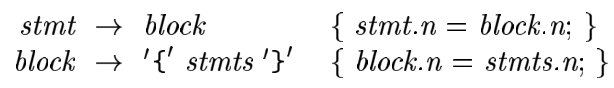{ : style="height:50px"}

上面的规则中:

- 第 1 条: 若一个语句是语句块, 则它的语法树等于这个块的语法树
- 第 2 条: 一个非终结符号 $block$ 对应的抽象语法树就是该块中的语句序列对应的语法树.

#### 表达式 (expression) 的语法树

进一步扩充表达式文法, 增加比较运算符, 增加一个新的非终结符 $add$

<!-- 在 [2.2.6 节](/chap_02/#226) 中提到过, 非终结符号的数目正好比表达式中优先级的层数多一. 这在 -->

1. **抽象语法** 允许我们将 "类似的" 算符归为一组, 以减少实现时不同的子类;
2. 在实际实现时, 可以在算符对应的树结点增加域 (或属性) 来表示具体的算符是什么;
   - 算符的种类决定结点的类型 , 如 Op/ Cond/ Assign 等
   - 增加算符标识, 如把 `*` 作为结点上增加的属性, 以决定结点的翻译等

### 2.8.3 静态检查

**静态检查**: 在编译阶段完成的各种一致性检查, 排除错误.

**语法检查**: 目前编译器能够发现的错误, 多数是在语法分析阶段发现的.

- 有些错误是不符合语法的格式要求, 如括号不配对/ 该出现运算对象的地方出现了运算符等, 多数通过**语法分析过程中的匹配 (`match`) 或归约过程**发现错误
- 有些错误是不符合语法规则的约束条件 (这些可能是难以形式化描述, 通常作为语法规则的约束条件出现, 如 `break` 必须在循环等结构中/ 变量的先声明后使用等) , 这些是**伴随语法分析过程, 作为语义动作实现**

**类型检查**: 检查运算符与运算对象的类型是否匹配, 不匹配要报错.

- 如果语言要求进行自动的类型转换, 则编译器在检测到类型不匹配时, 要进行插入自动的类型转换, 如果没有合适的规则插入, 再报错

#### 左值和右值

| Item  | 左值          | 右值               |
| ----- | ------------- | ------------------ |
| 含义  | 存储位置      | 存放的值           |
| range | 表达式/标识符 | 表达式/标识符/常量 |

> 赋值号两侧都可以是表达式, 但是赋值号左侧的表达式最终应该得到一个左值, 而对于右侧的表达式, 采用的则是其右值

静态检查要保证左值和右值出现在恰当的位置.

#### 类型检查

**类型检查**: 确保一个构造的类型符合上下文的期望.

类型检查规则按照抽象语法中运算符/ 运算分量的结构进行描述.

考虑特殊情形:

- **自动类型转换**: 需要对可以经过自动转换变匹配的情形返回正确
  - 如: 一些程序允许整数和浮点数的直接比较
- **重载**: 如果一个符号在不同上下文中有不同的含义, 那么我们说这个符号是重载 (over-loading) 的
  - 如: `java` 中的 `+` 在应用于整数运算分量时表示相加, 但在应用于字符串型运算分量时表示 concat, 此时需要根据已知的运算分量类型和结果类型来判断一个重载的运算符的含义.

### 2.8.4 三地址码

#### 三地址指令

三地址指令格式形如 `x = y op z`; `op` 是运算符, `x, y, z` 可以是变量/常量/临时量等.

1. (顺序) 如果没有显式的转移指令, 三地址代码将顺序执行
2. (数组+) 有些操作要分解成多个三地址指令完成, 如数组将由下面的两条指令处理 (数组元素访问占用两个地址):
   - `x[y] = z` : 将 `z` 的值保存到 `x[y]` 的位置上
   - `x = y[z]` : 将 `x[y]` 的值保存到 `z` 的位置上
3. (转移) 转移指令如下:
   - `ifFalse x goto L` : `x` 为假, 跳转到标号为 `L` 的指令
   - `ifTrue x goto L` : `x` 为真, 跳转到标号为 `L` 的指令
   - `goto L` : 无条件跳转到标号为 `L` 的指令
4. (拷贝) 复写指令: `x = y` 将 `y` 的值拷贝至 `x` 中

#### 语句的翻译

利用几种三地址代码, 就可以实现语句中控制流的变化, 比如使用转移三地址指令来翻译 `if-else` 控制流. (应该属于常识级别的东西吧...?)

对于一个 `if` 语句, `If` 构造函数扩建了语法树的结点, 并为相关属性赋值, 申请了新的编号; `gen` 函数生成三地址代码, 它调用了 `expr` 和 `stmt` 等过程, 完成了相关翻译.

例子:

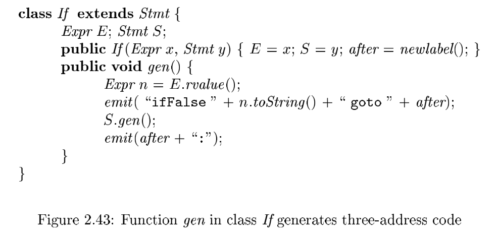{ : style="height:180px"}

#### 表达式的翻译

> 考虑包含二目运算符 `op`, 数组访问和赋值运算, 并包含常量及标识符的表达式

1. 简便起见, 为一个表达式的语法树中的 **每个运算符结点** 都生成一个三地址指令
   - 注意! 不需要为 _标识符_ 和 _常量_ 生成任何代码, 因为它们可以作为 **地址** 出现在指令中
2. 翻译过程中可能引入临时变量
   - 如 `i-j+k` 的处理
3. 数组访问/ 赋值运算: 区分左值和右值
   - 右值: 计算出右值, 暂存在临时量中, 从而得到翻译结果
     - 例如翻译 `2*a[i]` , 可以得到 `t1=a[i], t2=2*t1` 这样的结果
   - 左值: not simple

> 解决数组访问/赋值运算的 "统一"的 & "简单"的 方法是使用函数 `lvalue` 和 `rvalue`. 来讲讲 `lvalue` 和 `rvalue`... 太糟心了.

##### `lvalue` 函数

左值访问的情况:

- 标识符 (简单情形)
- 数组访问 (new 一个 Access 结点)

伪代码:

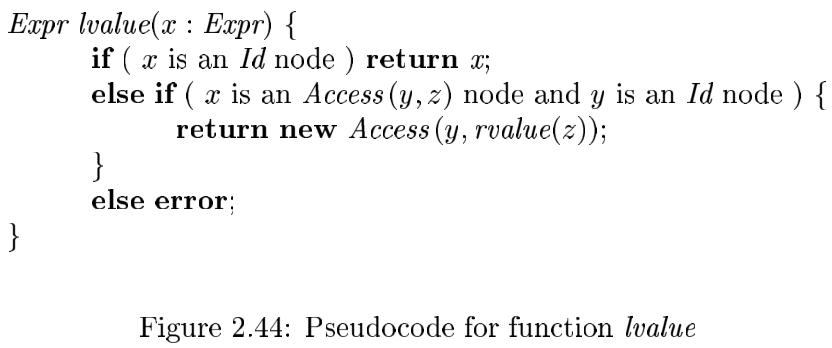{ : style="height:180px"}

**例程**: 结点 `x` 表示数组访问 `a[2*k]` 时, `lvalue(x)` 生成:

```java
t = 2 * k
```

并且

```java
return new Access(y,rvalue(z));
```

##### `rvalue` 函数

右值访问的情况:

| 结点 `x` | 计算                                                              | **返回**      |
| -------- | ----------------------------------------------------------------- | ------------- |
| `y op z` | `rvalue` 递归计算 `y,z` 的右值 `y', z'` , 产生指令 `t = y' op z'` | 返回结点 `t`  |
| `y[z]`   | 复用 `lvalue` 函数, 返回数组访问 `y[z']` , 生成指令 `t = y[z']`   | 返回结点 `t`  |
| `y = z`  | 计算 `z'=rvalue(z)` , 生成计算 `lvalue(y) = z'` 的指令            | 返回结点 `z'` |

伪代码:

{ : style="height:350px"}

**例程**: 将 `rvalue` 应用于 `a[i] = 2 * a[j-k]` 语法树时, 它将生成:

```java
t3 = j - k
t2 = a[t3]
t1 = 2 * t2
a[i] = t1
```

#### 改进表达式的代码

##### (a) 在优化阶段,减少拷贝指令的数目

**例 1**: 根据指令序列中标识符的使用情况进行优化

对于

```java
t = i + 1
i = t
```

如果 `t` 没有其他的使用点, 则可以优化为

```java
i = i + 1
```

**例 2**: 通过某种回填技术减少拷贝指令

对于

```java
j + k
```

暂时生成

```java
null = j + k
```

如果其后发现 `j + k` 是一个赋值语句的右部, 且左部是一个标量 (可以简单理解为是非数组访问), 例如 `i` , 则直接生成

```java
i = j + k
```

#### (b) 充分考虑上下文, 在最初生成指令时就减少生成的指令

例如, 如果三地址赋值语句左部:

- 是一个数组元素, 则右部只能是一个**单地址**的量;
- 是一个名字 `x`, 那么其右部可以是一个使用两个地址的运算 `y op z`.

## 2.9 第 2 章总结

本章介绍的语法制导翻译技术可以用于构造下图中简易编译器的前端.

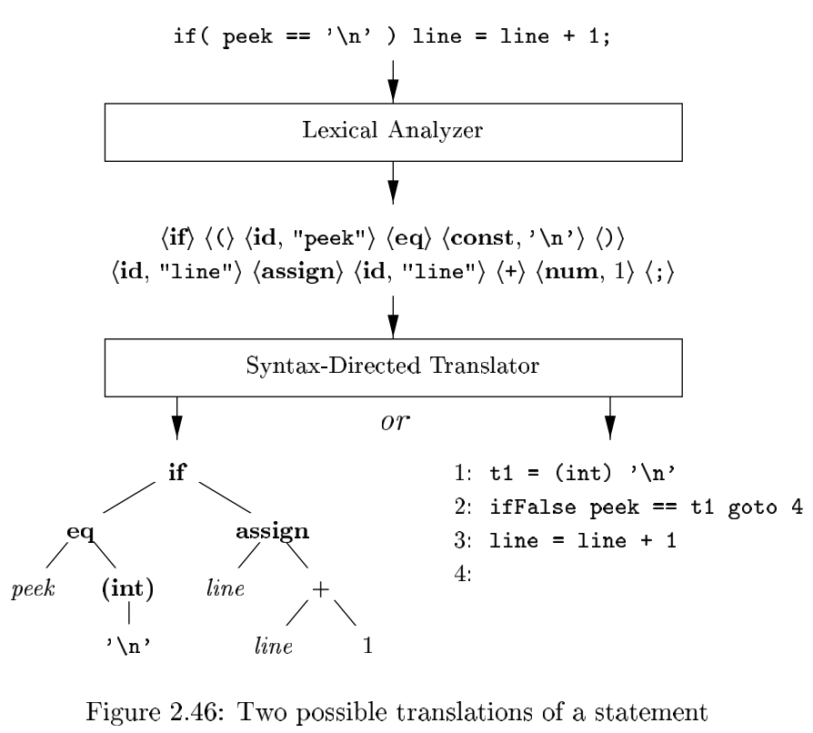{ : style="height:400px"}

构造一个语法制导翻译器要从源语言的文法开始. 一个**文法**描述了程序的层次结构. 文法的定义使用了称为**终结符号**的基本符号和称为**非终结符号**的变量符号. 这些符号代表了语言的构造. 一个文法的规则, 即**产生式**, 由一个作为**产生式头**或**产生式左部**的非终结符, 以及称为**产生式体**或**产生式右部**的终结符号/非终结符号序列组成. 文法中有一个非终结符被指派为**开始**符号.

在描述一个翻译器时, 在程序构造中附加 "属性" 是非常有用的. **属性**是指与一个程序构造关联的任何量值. 因为程序构造是使用文法符号来表示的, 因此属性的概念也被扩展到文法符号上. 属性的例子包括与一个表示数字的终结符号 $num$ 相关联的整数值, 或与一个表示标识符的终结符号 $id$ 相关联的字符串.

词法分析器从输入中逐个读取字符, 并输出一个**词法单元**的流, 其中词法单元由一个终结符号以及以属性值形式出现的附加信息组成. 在上面的图 2-46 中, 词法单元被写成用 `<>` 括起的元组. 词法单元 `<id, "peek">` 分由终结符号 $id$ 和一个指向包含字符串 `"peek"` 的符号表条目的指针构成. 翻译器使用符号表来存放保留字和已经遇到的标识符.

**语法分析**要解决的问题是指出如何从一个文法的开始符号推导出一个给定的终结符号串. 推导的方法是反复将某个非终结符替换为它的某个产生式的体. 从概念上讲, 语法分析器会创建一棵语法分析树. 该树的根结点的标号为文法的开始符号, 每个非叶子结点对应于一个产生式, 每个叶子结点的标号为一个终结符号或空串 $\epsilon$. 语法分析树推导出由它的叶子结点从左到右组成的终结符号串.

使用被称为预测语法分析法的自顶向下 (从语法分析树的根结点到叶子结点) 方法可以手工建立高效的语法分析器. **预测分析器**有对应于每个非终结符的子过程. 该过程的过程体模拟了这个非终结符号的各个产生式. 只要在输入流中**向前看**一个符号, 就可以无二义地确定该过程体中的控制流. 其他语法分析方法见第 4 章.

语法制导翻译通过在文法中添加规则或程序片段来完成. 在本章中, 我们只考虑了**综合**属性. 任意结点无上的一个综合属性的值只取决于元的子结点 (如果有的话) 上的属性值. **语法制导定义**将规则和产生式相关联, 这些规则用于计算属性值. 语法制导的**翻译方案**在产生式体中嵌入了称为**语义动作**的程序片段. 这些语义动作按照语法分析中产生式的使用顺序执行.

语法分析的结果是源代码的一种中间表示形式, 称为**中间代码**. 图 2-46 列出了中间代码的两种主要形式. **抽象语法树**中的各个结点代表了程序构造, 一个结点的子结点给出了该构造有意义的子构造. 另一种表示方法是**三地址代码**, 它是一个由三地址指令组成的序列, 其中每个指令只执行一个运算.

**符号表**是存放有关标识符的信息的数据结构. 当分析一个标识符的声明的时候, 该标识符的信息被放入符号表中. 当在后来使用这个标识符时, 比如它作为一个表达式的因子使用时, 语义动作将从符号表中获取这些信息.

## 参考资料

1. [ucas-compiler-20sp-notes/chapter2.md at main · CacaoGatto/ucas-compiler-20sp-notes](https://github.com/CacaoGatto/ucas-compiler-20sp-notes/blob/main/chapter2.md)

<!-- Footnotes -->

[^1]: 这些信息在编译器的分析阶段被逐步收集并放入符号表, 它们在综合阶段用于生成目标代码.
