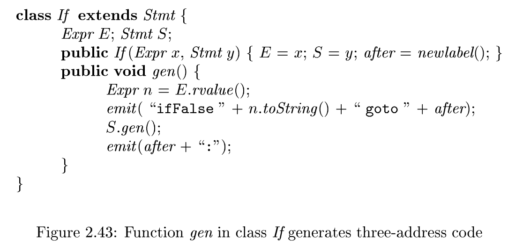

# hw 02 - 02

## 练习 2.8.1

C 语言和 Java 语言中的 `for` 语句具有如下形式：

```java
for ( expr1 ; expr2 ; expr3 ) stmt
```

- 第一个表达式在循环之前执行, 它通常被用来初始化循环下标.
- 第二个表达式是一个测试, 它在循环的每次迭代之前执行. 如果这个表达式的结果变成 0, 就退出循环. 循环本身可以被看作语句 `{ stmt expr3 ;}`.
- 第三个表达式在每一次迭代的末尾执行, 它通常用来使循环下标递增, 故 `for` 语句的含义类似于

```java
expr1 ; while(expr2) { stmt expr3 ;}
```

仿照图 2-43 中的类 `If`, 为 `for` 语句定义一个类 `For`.

{ : style="height:200px"}

### Sol.

根据提示, For 的代码布局大致为:

```
        expr1
label1: x = expr2
        IfFalse x  goto after
        Stmt
        expr3
        goto label1
After:  ...
```

因此类 `For` 如下:

```java
class For extends Stmt{
    Expr E1; Expr E2; Expr E3; Stmt S;
    Public For(Expr x1, Expr x2, Expr x3, Stmt y){
        E1 = x1; E2 = x2; E3 = x3; S = y; after = newlabel();
    }
    Public void gen(){
        E1.gen();
        emit(label1+":");
        Expr n = E2.rvalue();
        emit("ifFalse"+n.toString()+"goto"+after);
        S.gen();
        E3.gen();
        emit("goto"+label1);
        emit(after+":");
    }
}
```

<!-- 自己参考 2.9 节, 复习总结第二章 (不用交) -->
