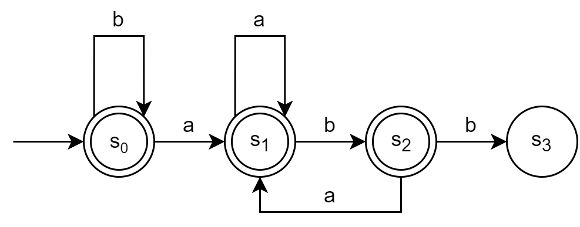
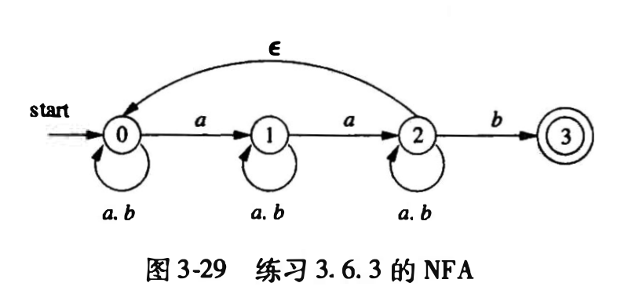

# hw 03 - 02

## Ex. 1

为下面的语言设计一个 DFA 或 NFA:

### Sol.

#### (1) 包含 5 个元音的所有小写字母串, 这些串中的元音按顺序出现


#### (2) 所有由 $a$ 和 $b$ 组成且不含子串 $abb$ 的串



## 练习 3.7.2 (1)

用算法 3.22 模拟图 3-29 中的 NFA 在处理输入 $aabb$ 时的过程.



### Sol.

Algorithm 3.22:

```c
S = epsilon-closure(s_0);
c = nextChar();
while (c != eof) {
    S = epsilon-closure(move(S,c));
    c = nextChar();
}
if (Cap(S, F)!=EmptySet) return "yes";
else return "no";
```

已知 $F=\{3\}$ , 按照算法执行:

| $S$           | $c$ | Additional Info             |
| ------------- | --- | --------------------------- |
| $\{0\}$       | a   | // Before while             |
| $\{0,1\}$     | a   | // Enter while              |
| $\{0,1,2\}$   | b   |                             |
| $\{0,1,2,3\}$ | b   |                             |
| $\{0,1,2,3\}$ | eof | return "yes"; // Exit while |

## 练习 3.7.3

使用算法 3.23 和 3.20 将下述正则表达式转换为 DFA, 并尝试化简该 DFA

### Sol.

#### (3) $((\epsilon| a)b^{*})^{*}$

使用算法 3.23 (McNaughton-Yamada-Thompson algorithm) 将正则表达式转换为 NFA:


使用算法 3.20 (子集构造法) 将 NFA 转换为 DFA:

转换表:

| NFA State                | DFA State | a   | b   |
| ------------------------ | --------- | --- | --- |
| $\{0,1,2,3,4,6,7,9,10\}$ | s0        | s1  | s2  |
| $\{1,2,3,4,5,6,7,9,10\}$ | s1        | s1  | s2  |
| $\{1,2,3,4,6,7,8,9,10\}$ | s2        | s1  | s2  |

DFA:


#### (4) $(a|b)^{*}abb(a|b)^{*}$

使用算法 3.23 将正则表达式转换为 NFA:


使用算法 3.20 将 NFA 转换为 DFA:

转换表:

| NFA State                              | DFA State | a   | b   |
| -------------------------------------- | --------- | --- | --- |
| $\{0,1,2,3,7\}$                        | A         | B   | C   |
| $\{1,2,3,4,6,7,8\}$                    | B         | B   | D   |
| $\{1,2,3,5,6,7\}$                      | C         | B   | C   |
| $\{1,2,3,5,6,7,9\}$                    | D         | B   | E   |
| $\{1,2,3,5,6,7,10,11,12,13,17\}$       | E         | F   | G   |
| $\{1,2,3,5,6,7,8,11,12,13,14,16,17\}$  | F         | F   | H   |
| $\{1,2,3,5,6,7,11,12,13,15,16,17\}$    | G         | F   | G   |
| $\{1,2,3,5,6,7,9,11,12,13,15,16,17\}$  | H         | F   | I   |
| $\{1,2,3,5,6,7,10,11,12,14,15,16,17\}$ | I         | F   | G   |

DFA:


