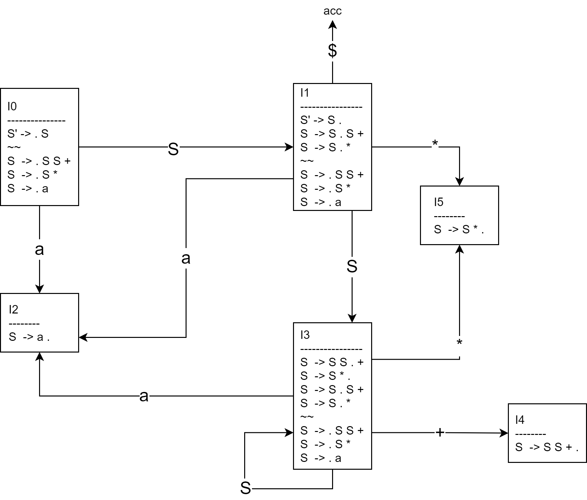
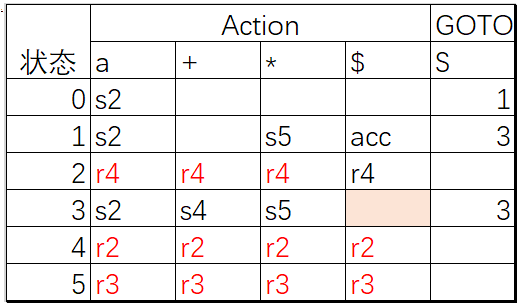
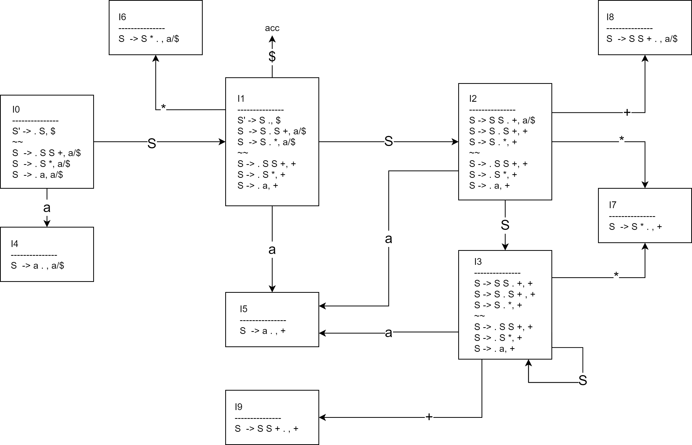
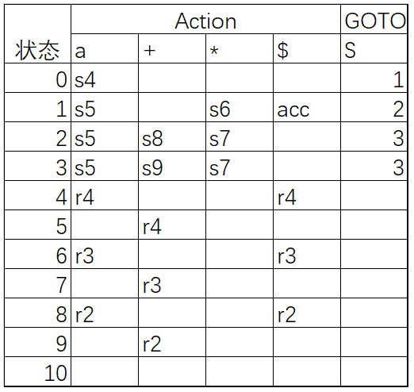
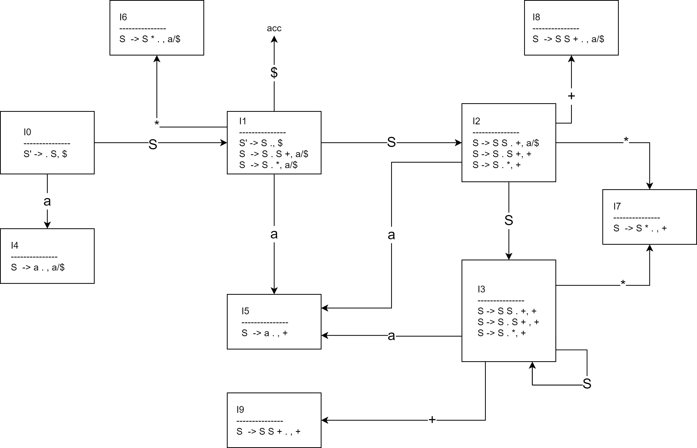

# hw 04 - 03

## Ex. 1

对于文法 `S → S S + | S * | a` 和下面的最右句型, 指出其归约时使用到的句柄.

1. `S S + a * +`
2. `S S * a +`
3. `a a * a + + a +`

> See also Ex. 4.5.2.

### Solution

1. `S S +`
2. `S *`
3. `a`

## Ex. 2

对于文法 `S → S S + | S * | a` ,

1. 增广该文法, 构造 SLR 项目集;
2. 计算这些项目集的 GOTO 函数, 给出这个文法的语法分析表;
3. 这个文法是 SLR 文法吗?

> See also Ex. 4.6.2

### Solution

**增广该文法**: (行号=编号)

```
S' -> S
S  -> S S +
S  -> S *
S  -> a
```

基于 LR(0) 项集族 `C={I0, I1, ...}` **构造 SLR 项目集**:

> 注: 下图中单个方框为集合, `----` 以上是集合名, `~~` 上下分别为求闭包得到/内核项得到.



**GOTO 函数**:

```
GOTO(I0, S) = I1, GOTO(I0, a) = I2,
GOTO(I1, S) = I2, GOTO(I1, *) = I5, GOTO(I1, a) = I2, GOTO(I1, $) = acc
GOTO(I3, a) = I2, GOTO(I3, S) = I3, GOTO(I3, +) = I4, GOTO(I3, *) = I5
```

FOLLOW(s): `FOLLOW(S) = {$}`

**语法分析表**:



**判断**: 该文法是 SLR 文法, 因为没有出现冲突的条目.

## Ex. 3

对于文法 `S → S S + | S * | a` ,

1. 构造规范 LR 项目集族;
2. 构建其语法分析表;
3. 构建 LALR 项目集族.

> See also Ex. 4.7.1, 4.7.3

### Solution

增广文法, 行号=编号:

```
S' -> S
S  -> S S +
S  -> S *
S  -> a
```

**构造规范 LR 项目集族**:



GOTO 函数:

```
GOTO(I0, S)=I1, GOTO(I0, a)=I4,
GOTO(I1, S)=I2, GOTO(I1, *)=I6, GOTO(I1, a)=I5, GOTO(I1, $)=acc,
GOTO(I2, S)=I3, GOTO(I2, *)=I7, GOTO(I2, +)=I8, GOTO(I2, a)=I5,
GOTO(I3, S)=I3, GOTO(I3, a)=I5, GOTO(I3, *)=I7, GOTO(I3, +)=I9
```

**构建语法分析表**:



**构建 LALR 项目集族**:


