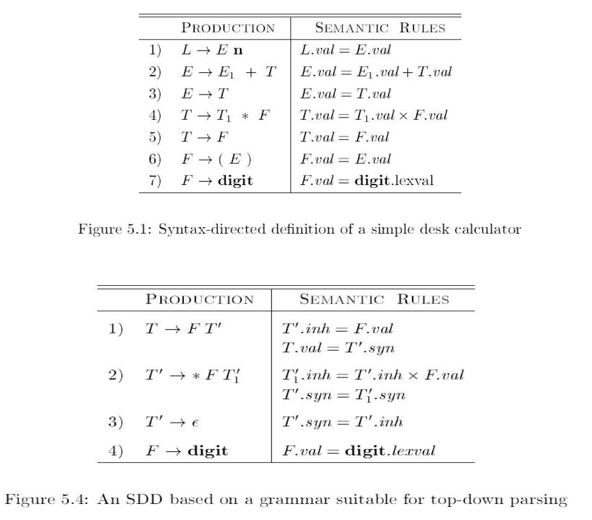

# hw 05 - 01

## Ex. 1

(1) 扩充图 5-4 中的 SDD, 使它可以像图 5-1 所示的那样处理表达式;

(2) 对于图 5-1 中的 SDD, 使用扩充后得到的 SDD 给出表达式 `3 * ( 4 + 5 ) n` 对应的注释语法分析.

### Solution

(1) 按照类似的方式扩充得到下表, 中间有消除左递归等措施:

| 产生式          | 语义规则                                          |
| --------------- | ------------------------------------------------- |
| `L -> E n`      | `L.val = E.val`                                   |
| `E -> T E'`     | `E'.inh = T.val` `E.val = E'.syn`              |
| `E' -> + T E1'` | `E1'.inh = E'.inh + T.val` `E'.syn = E1'.syn`  |
| `E' -> ε`       | `E'.syn = E'inh `                                 |
| `T -> F T'`     | `T'.inh = F.val`  `T.val = T'.syn`             |
| `T' -> * F T1'` | `T1'.inh = T'.inh × F.val`  `T'.syn = T1'.syn` |
| `T' -> ε`       | `T'.syn = T'.inh`                                 |
| `F -> ( E )`    | `F.val = E.val`                                   |
| `F -> digit`    | `F.val = digit.lexval`                            |

(2) `3 * ( 4 + 5 ) n` 对应的注释语法分析树:

## Ex. 2

假设我们有一个产生式 `A -> BCD`, A, B, C, D 这四个非终结符号都有两个属性: s 是一个综合属性, i 是一个继承属性. 对于下面的每组规则

1. A.s = B.i + C.s
2. A.s = B.i + C.s 和 D.i = A.i + B.s
3. A.s = B.s + D.s
4. A.s = D.i, B.i = A.s + C.s, C.i = B.s 和 D.i = B.i + C.i

指出:

(a) 这些规则是否满足 S 属性定义的要求.

(b) 这些规则是否满足 L 属性定义的要求.

(c) 是否存在和这些规则一致的求值过程? 若不存在, 请说明理由.

### Solution

> S 属性:
>
> - SSD 的每个属性都是综合属性 ↔ SDD 是 S 属性
>
> L 属性
>
> - SSD 的每个属性要么是综合属性, 要么是符合以下要求的继承属性
> - 要求: 计算和产生式头关联, or 与左侧文法符号关联, or 与本身其他属性关联但不成环

(a) 只有 (3) 满足 S 属性要求.

(b) (1)~(3) 满足 L 属性要求, (4) 不满足.

(c) (1)~(3) 存在, (4) 不存在.

> 原答案
>
> (b) 规则 (1) 不确定, 规则 (2) (3) 满足 L 属性要求, 规则 (4) 依赖图中成环故而不满足要求.
>
> (c) 存在.
